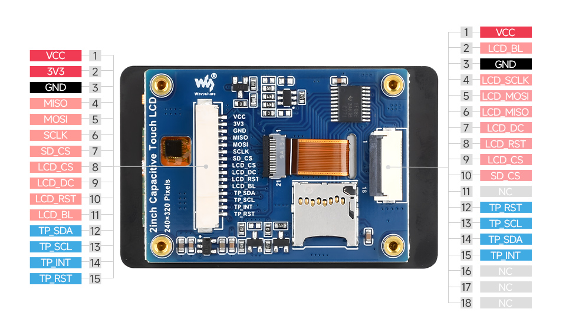
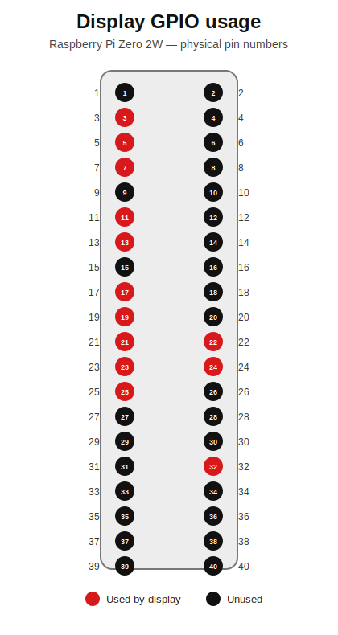
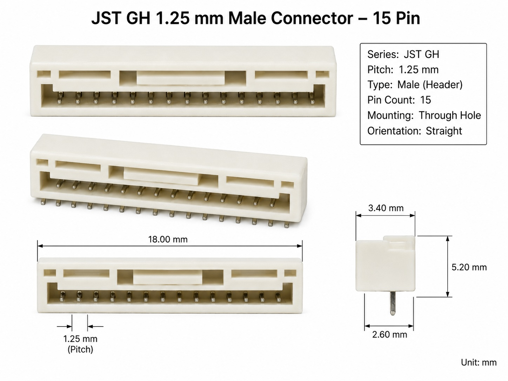
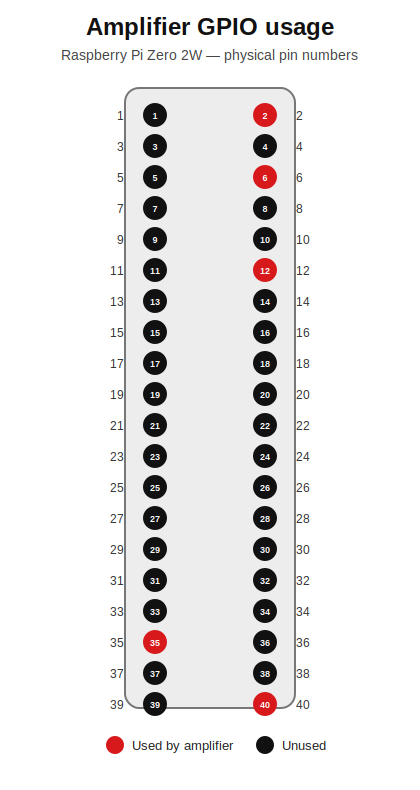
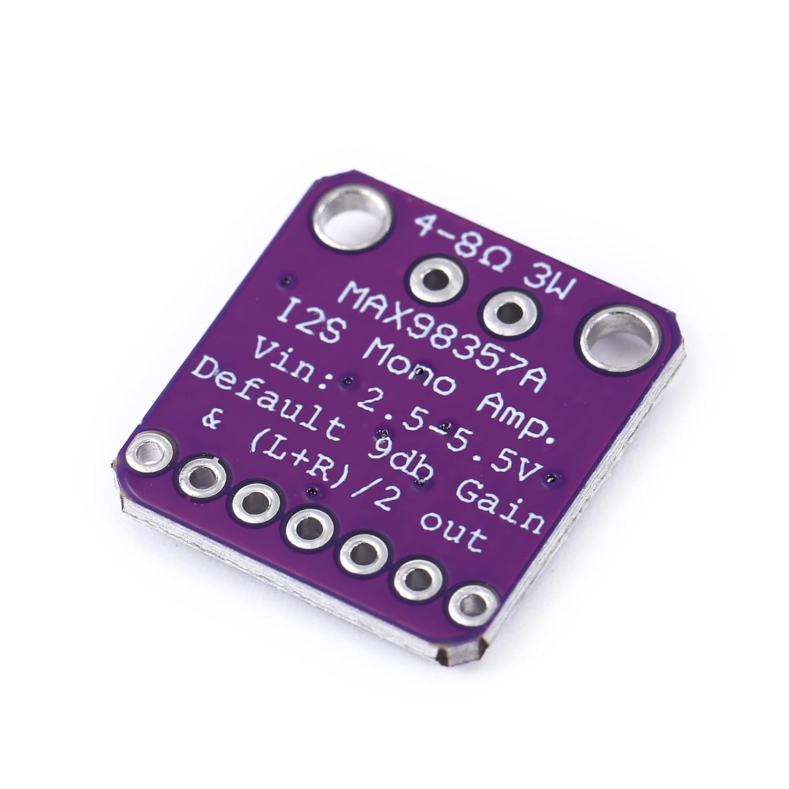
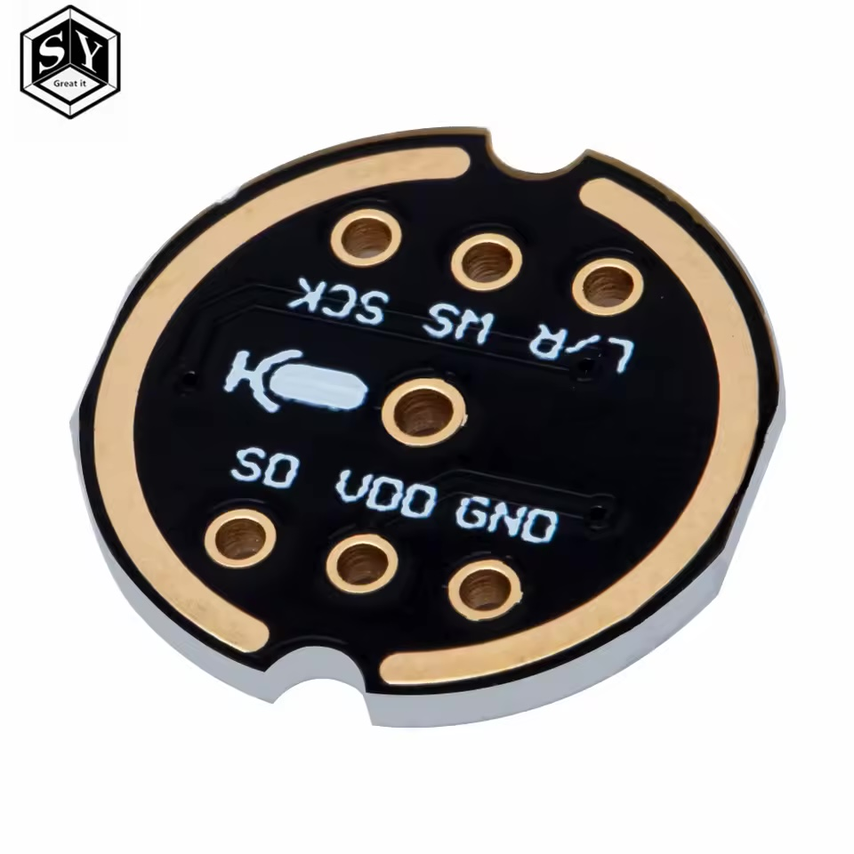
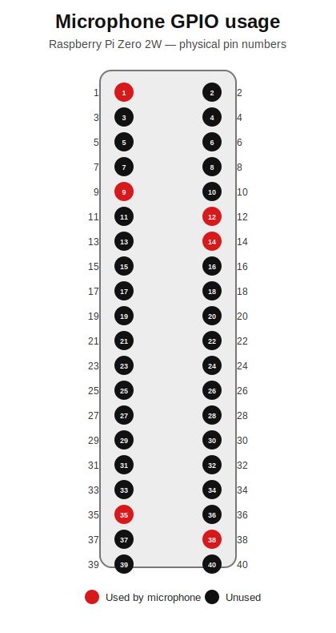
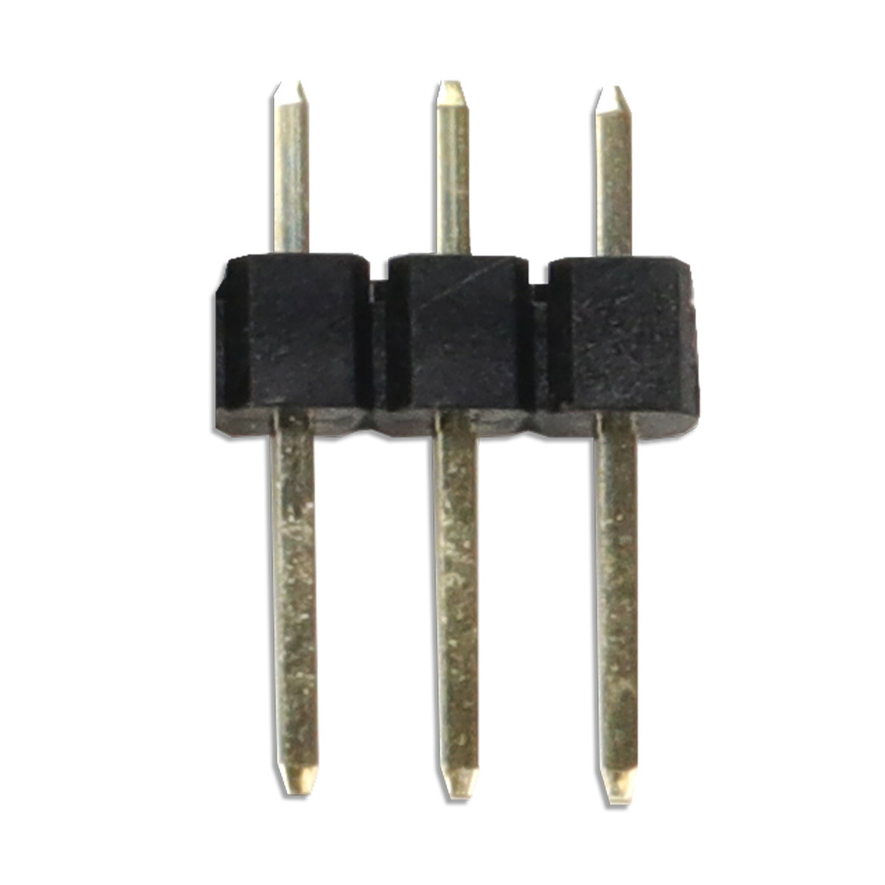
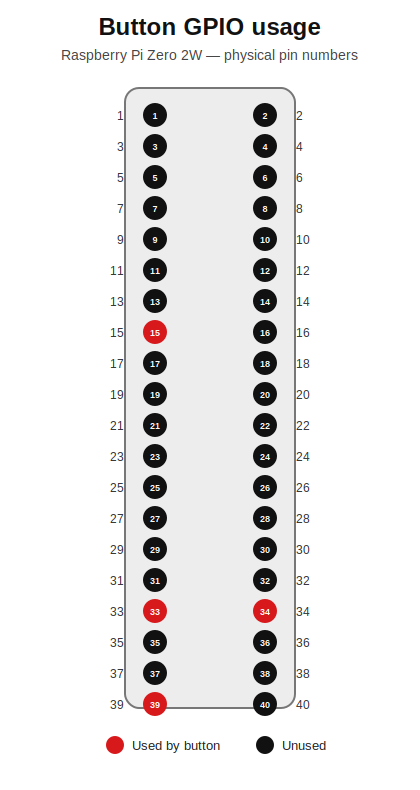
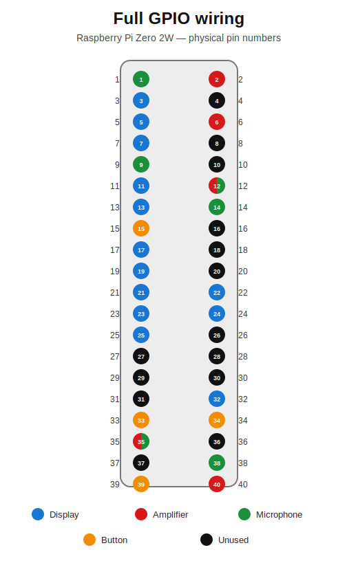

# PiTalk PCB — Pin Connections

This document defines the electrical pin mapping for the PiTalk carrier PCB,
designed from scratch around the **Raspberry Pi Zero 2W** 40-pin header.

Each accessory gets its own section with a pin-mapping table. Columns:

| Column | Meaning |
|--------|---------|
| `pi_pin` | Physical pin number on the Pi 40-pin header (1–40) |
| `pi_bcm` | Broadcom GPIO number (BCMxx), or the power rail name for power/ground pins |
| `accessory_pin` | Signal/function on the accessory side (e.g. `gnd`, `v3.3`, `clock`) |

> Buses are shared where the hardware requires it: SPI0 drives the display,
> I2C1 drives the touch controller, and the I2S/PCM bus is shared by the
> amplifier (output) and microphone (input).

---

## Raspberry Pi Zero 2W — 40-pin header reference

For convenience, the full header pinout this design draws from:

| pi_pin | pi_bcm | pi_pin | pi_bcm |
|-------:|--------|-------:|--------|
| 1  | 3V3        | 2  | 5V          |
| 3  | BCM2 (SDA1)| 4  | 5V          |
| 5  | BCM3 (SCL1)| 6  | GND         |
| 7  | BCM4       | 8  | BCM14 (TXD) |
| 9  | GND        | 10 | BCM15 (RXD) |
| 11 | BCM17      | 12 | BCM18 (PCM_CLK) |
| 13 | BCM27      | 14 | GND         |
| 15 | BCM22      | 16 | BCM23       |
| 17 | 3V3        | 18 | BCM24       |
| 19 | BCM10 (MOSI)| 20 | GND        |
| 21 | BCM9 (MISO)| 22 | BCM25       |
| 23 | BCM11 (SCLK)| 24 | BCM8 (CE0) |
| 25 | GND        | 26 | BCM7 (CE1)  |
| 27 | BCM0 (ID_SD)| 28 | BCM1 (ID_SC)|
| 29 | BCM5       | 30 | GND         |
| 31 | BCM6       | 32 | BCM12       |
| 33 | BCM13      | 34 | GND         |
| 35 | BCM19 (PCM_FS)| 36 | BCM16     |
| 37 | BCM26      | 38 | BCM20 (PCM_DIN) |
| 39 | GND        | 40 | BCM21 (PCM_DOUT)|

---

## Display — Waveshare 2" Capacitive Touch (ST7789T3 + CST816D)

Single module combining an SPI display (ST7789T3) and an I2C capacitive
touch controller (CST816D). Driven by SPI0 (display) and I2C1 (touch).
Pin mapping follows the "Working with Raspberry Pi" table on the
[Waveshare 2inch Capacitive Touch LCD wiki](https://www.waveshare.com/wiki/2inch_Capacitive_Touch_LCD).
The `accessory_pin_id` numbering follows the module's
[pinout diagram](https://www.waveshare.com/img/devkit/LCD/2inch-Capacitive-Touch-LCD/2inch-Capacitive-Touch-LCD-details-9.jpg)
(the 15-pin header).



| pi_pin | pi_bcm | accessory_pin | accessory_pin_id |
|-------:|--------|---------------|-----------------:|
| 17 | 3V3          | vcc (v3.3)                                         | 1  |
| —  | — (not connected) | 3v3 (on-module regulator output)                   | 2  |
| 25 | GND          | gnd                                                | 3  |
| 21 | BCM9 (MISO)  | miso (spi miso)                                    | 4  |
| 19 | BCM10 (MOSI) | mosi (spi data in)                                 | 5  |
| 23 | BCM11 (SCLK) | sclk (spi clock)                                   | 6  |
| —  | — (not connected) | sd_cs (on-module sd slot)                          | 7  |
| 24 | BCM8 (CE0)   | lcd_cs (display chip select)                       | 8  |
| 22 | BCM25        | lcd_dc (data/command)                              | 9  |
| 13 | BCM27        | lcd_rst (display reset)                            | 10 |
| 32 | BCM12        | lcd_bl (backlight) — remapped from BCM18, see note | 11 |
| 3  | BCM2 (SDA1)  | tp_sda (touch i2c data)                            | 12 |
| 5  | BCM3 (SCL1)  | tp_scl (touch i2c clock)                           | 13 |
| 7  | BCM4         | tp_int (touch interrupt)                           | 14 |
| 11 | BCM17        | tp_rst (touch reset)                               | 15 |



> Accessory pins **2** (`3V3`, the on-module regulator output) and **7**
> (`SD_CS`, the micro-SD slot's chip select) are left unconnected on this board
> — both shown mapping to nothing above.
>
> 🔧 **Backlight remapped:** the Waveshare default wires `LCD_BL` to **BCM18**,
> which is also `PCM_CLK` (I2S BCLK) used by the amplifier and microphone below.
> Since BCM18 cannot serve both, `LCD_BL` is remapped on this board to
> **BCM12 (pin 32)** — a hardware-PWM-capable pin — freeing BCM18 for I2S.
> This requires routing `LCD_BL` to pin 32 on the PCB (not pin 12) and setting
> the backlight GPIO to BCM12 in software.

### PCB Connector

JST GH SM15B-GHS-TB 1.25 mm 15-pin male side-entry PCB header



✅ **Verified**

---

## Amplifier — MAX98357A I2S Class-D (3W)

Receives audio from the Pi over the I2S/PCM bus. Mounted on the PCB via a
female socket (per board requirements). Speaker connects to its output.


The `accessory_pin_id` numbering follows the module's 1×7 header order
(`LRC`, `BCLK`, `DIN`, `GAIN`, `SD`, `GND`, `VIN`).

| pi_pin | pi_bcm | accessory_pin | accessory_pin_id |
|-------:|--------|---------------|-----------------:|
| 35 | BCM19 (PCM_FS)  | lrc (lr / word clock)              | 1 |
| 12 | BCM18 (PCM_CLK) | bclk (bit clock)                   | 2 |
| 40 | BCM21 (PCM_DOUT)| din (i2s data in)                  | 3 |
| —  | — (not connected) | gain (gain select)               | 4 |
| —  | — (not connected) | sd (shutdown / channel select)   | 5 |
| 6  | GND           | gnd                                  | 6 |
| 2  | 5V            | vin (5v)                             | 7 |



The module's back-side silkscreen documents its onboard defaults:



> ```
> 4-8Ω 3W
> MAX98357A
> I2S Mono Amp.
> Vin: 2.5-5.5V
> Default 9db Gain
> & (L+R)/2 out
> ```

> Accessory pins **4** (`GAIN`) and **5** (`SD`, shutdown/channel-select) are
> set by the module's onboard resistors (not driven by the Pi) — both shown
> mapping to nothing above, and both left unconnected on this carrier.
>
> The module's silkscreen confirms its as-shipped defaults with these pins
> unconnected:
> - **`GAIN` left floating → +9 dB gain.**
> - **`SD` held by the onboard pull at the level that both enables the amplifier
>   and selects `(L+R)/2` stereo-averaged mono output.** Because the breakout
>   actively pulls `SD` to an enabled state, leaving it unconnected does **not**
>   shut the amplifier down — the chip powers up enabled in mono.
>
> This is why pins 4 and 5 are safe to leave unconnected on the PCB: the
> purchased module already sets them. (Verify the actual board carries these
> pulls — bare MAX98357A clones without the `SD` pull would otherwise stay in
> shutdown.)

### PCB Connector

2.54mm 7pin socket


✅ **Verified**

---

## Microphone — INMP441 I2S MEMS

Sends audio to the Pi over the same I2S/PCM bus (shares BCLK and LRCLK with
the amplifier; uses the PCM data-in line). Connects via a board header.



The `accessory_pin_id` numbering follows the module's two 3-pin headers,
left-to-right: header 1 is `SD`, `VDD`, `GND`; header 2 is `L/R`, `WS`, `SCK`.

| pi_pin | pi_bcm | accessory_pin | accessory_pin_id |
|-------:|--------|---------------|-----------------:|
| 38 | BCM20 (PCM_DIN)| sd (i2s data out)                   | 1 |
| 1  | 3V3            | vdd (v3.3)                          | 2 |
| 9  | GND            | gnd                                 | 3 |
| 14 | GND            | l/r (channel select → gnd = left)   | 4 |
| 35 | BCM19 (PCM_FS) | ws (word select)                    | 5 |
| 12 | BCM18 (PCM_CLK)| sck (bit clock)                     | 6 |



> Accessory pin **4** (`L/R`) is a static channel-select input, not a signal
> the Pi drives — tying it to `gnd` selects the left channel. Here it is wired
> to the Pi's **GND on pin 14** (a dedicated ground pin, separate from the mic's
> own `gnd` on pin 9). The mic module solders onto the headers straight through,
> unmodified — do **not** short `L/R` to `gnd` on the module; the tie is made
> through the header to the Pi ground pin.

### PCB Connector

2.54mm 1×3 male pin header (×2)

Two 2.54mm 1×3 male pin headers. The six accessory pins are split across the
two headers in `accessory_pin_id` order — pins 1–3 on the first header, pins
4–6 on the second. Pin order below is left-to-right, matching the module.



```
Header A (1×3 male)          Header B (1×3 male)
┌───┬───┬───┐                ┌───┬───┬───┐
│ ▯ │ ▯ │ ▯ │                │ ▯ │ ▯ │ ▯ │
└───┴───┴───┘                └───┴───┴───┘
  1   2   3                    4   5   6
 sd  vdd gnd                 l/r  ws  sck
```

| header | pins (left-to-right) | accessory_pin_id |
|--------|----------------------|------------------|
| A | sd, vdd, gnd  | 1, 2, 3 |
| B | l/r, ws, sck  | 4, 5, 6 |

✅ **Verified**

---

## Speaker — Gikfun 2" 4Ω 3W

The speaker does **not** connect to the Pi header, and it is **not** a carrier
PCB connector. It wires directly to the amplifier module's bridge-tied output
terminals (`OUT+`/`OUT-`) on the MAX98357A board itself.

| amp_pin | accessory_pin |
|---------|---------------|
| out+ | speaker + |
| out- | speaker - |

✅ **Verified**

---

## Button — Momentary push button with LED

Switch contact reads as a GPIO input; the LED is driven through an on-board
series current-limiting resistor.

| pi_pin | pi_bcm | accessory_pin |
|-------:|--------|---------------|
| 15 | BCM22 | sw (switch input)        |
| 34 | GND   | sw_gnd (switch return)   |
| 33 | BCM13 | led+ (via series resistor) |
| 39 | GND   | led- (led cathode)       |



### PCB Connector

2.54mm 1×4 male pin header

A single 2.54mm 1×4 male pin header carries all four button signals,
left-to-right: `sw`, `sw_gnd`, `led+`, `led-`.


```
1×4 male header
┌────┬────────┬──────┬──────┐
│ ▯  │   ▯    │  ▯   │  ▯   │
└────┴────────┴──────┴──────┘
  1       2       3      4
  sw    sw_gnd   led+   led-
```

---

## Full wiring

Consolidated view of every Raspberry Pi pin and which accessory pin it
connects to. `—` means that accessory does not use the pin. Power and ground
rails span several physical header pins; the per-component sections above list
the specific pins used.

Rows are one physical pin each. Where an accessory shares a rail (3V3, GND),
a separate header pin is allocated per accessory so every connection maps to a
single pin. (BCM18/BCM19 are genuine shared signal nets and stay on one pin.)
In addition to the per-accessory GND pins, **all remaining Pi ground pins
(20 and 30) are also tied to the board GND plane** — they carry no accessory
signal but provide extra ground returns. They appear below as GND rows with
`—` in every accessory column.



| pi_pin | pi_bcm | display | amplifier | microphone | button |
|-------:|--------|---------|-----------|------------|--------|
| 1  | 3V3             | —        | —    | vdd  | —      |
| 2  | 5V              | —        | vin  | —    | —      |
| 3  | BCM2 (SDA1)     | tp_sda   | —    | —    | —      |
| 5  | BCM3 (SCL1)     | tp_scl   | —    | —    | —      |
| 6  | GND             | —        | gnd  | —    | —      |
| 7  | BCM4            | tp_int   | —    | —    | —      |
| 9  | GND             | —        | —    | gnd  | —      |
| 11 | BCM17           | tp_rst   | —    | —    | —      |
| 12 | BCM18 (PCM_CLK) | —        | bclk | sck  | —      |
| 13 | BCM27           | lcd_rst  | —    | —    | —      |
| 14 | GND             | —        | —    | l/r  | —      |
| 15 | BCM22           | —        | —    | —    | sw     |
| 17 | 3V3             | vcc      | —    | —    | —      |
| 19 | BCM10 (MOSI)    | mosi     | —    | —    | —      |
| 20 | GND             | —        | —    | —    | —      |
| 21 | BCM9 (MISO)     | miso     | —    | —    | —      |
| 22 | BCM25           | lcd_dc   | —    | —    | —      |
| 23 | BCM11 (SCLK)    | sclk     | —    | —    | —      |
| 24 | BCM8 (CE0)      | lcd_cs   | —    | —    | —      |
| 25 | GND             | gnd      | —    | —    | —      |
| 30 | GND             | —        | —    | —    | —      |
| 32 | BCM12           | lcd_bl   | —    | —    | —      |
| 33 | BCM13           | —        | —    | —    | led+   |
| 34 | GND             | —        | —    | —    | sw_gnd |
| 35 | BCM19 (PCM_FS)  | —        | lrc  | ws   | —      |
| 38 | BCM20 (PCM_DIN) | —        | —    | sd   | —      |
| 39 | GND             | —        | —    | —    | led-   |
| 40 | BCM21 (PCM_DOUT)| —        | din  | —    | —      |

> **Unused header pins** (not connected on this board):
> 4 (5V), 8 (BCM14/TXD), 10 (BCM15/RXD), 16 (BCM23), 18 (BCM24),
> 26 (BCM7/CE1), 27 (BCM0/ID_SD), 28 (BCM1/ID_SC), 29 (BCM5),
> 31 (BCM6), 36 (BCM16), 37 (BCM26).
>
> All eight Pi ground pins (6, 9, 14, 20, 25, 30, 34, 39) are tied to the
> board GND plane.

✅ **Verified**

---

## PCB Board

The carrier PCB must provide the following connectors, one per interface
(detailed in each accessory section above):

| # | Interface | Connector | Pins |
|--:|-----------|-----------|-----:|
| 1 | Raspberry Pi Zero 2W | 2×20 2.54 mm male pin header | 40 |
| 2 | Display (Waveshare 2" Touch) | JST GH SM15B 1.25 mm 1×15 male side-entry header | 15 |
| 3 | Amplifier (MAX98357A) | 2.54mm 1×7 female socket | 7 |
| 4 | Microphone (INMP441) | 2.54mm 1×3 male pin header (×2) | 3 + 3 |
| 5 | Button (push button + LED) | 2.54mm 1×4 male pin header | 4 |

> The speaker is **not** a PCB connector — it wires directly to the
> amplifier's output (see the Speaker section), not to the carrier board.

### Four-layer implementation

The KiCad implementation is a **76 mm × 58 mm**, 1.6 mm four-layer board:

| Layer | Use |
|-------|-----|
| `F.Cu` | Connector escapes and primary signals |
| `In1.Cu` | Continuous GND plane |
| `In2.Cu` | Secondary signal routing |
| `B.Cu` | Remaining signals and power |

The microphone headers are placed on the opposite side of the board from the
amplifier socket. The amplifier socket and 5 V bulk capacitor are grouped
together. Four 3.2 mm mounting holes are provided.

KiCad board: [`kicad/pitalk.kicad_pcb`](kicad/pitalk.kicad_pcb)

KiCad schematic: [`kicad/pitalk.kicad_sch`](kicad/pitalk.kicad_sch)

Validation reports:

- [`kicad/erc.json`](kicad/erc.json) — schematic ERC
- [`kicad/drc-with-parity.json`](kicad/drc-with-parity.json) — PCB DRC and
  schematic/PCB parity
- [`kicad/PRE_MANUFACTURING_VALIDATION.md`](kicad/PRE_MANUFACTURING_VALIDATION.md)
  — datasheet, Gerber, power, layout, and remaining physical validation gates

The project ignores KiCad's `lib_footprint_mismatch` metadata warning because
the board is generated by `kiutils`. Pad counts, numbers, positions, sizes, and
drills were compared against the installed KiCad footprints and match exactly.
